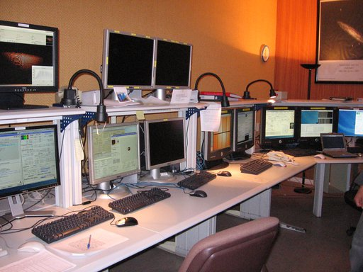

.. post:: 31 juliol de 2014
   :tags: astronomia, astrònom, telescopi, enginyeria

.. _que_es_un_astronom_de_suport:

Què és un astrònom de suport?
=============================

Si heu vingut a parar a aquesta pàgina per casualitat, potser us estareu
preguntant què caram és un astrònom de suport. En la primera entrada d'aquest
nou bloc, us ho explico tot amb pèls i senyals.

Per si teniu pressa, podeu :ref:`anar directament al final<resumint>` per
saber-ho. Pels que tingueu dos minuts, és bastant probable que tots hagueu vist
fotografies com aquesta en algun moment:"

.. figure:: ../_static/20091102_1.jpg
   :align: center

   Imatge del GTC obtinguda el 2 de november de 2009.

.. :align:left

En aquesta imatge s'hi pot veure un dels telescopis més grans del món, el `GTC
<http://www.gtc.iac.es/GTChome.php>`_. Aquests grans telescopis són, en
realitat, un gran laboratori on hi ha algunes de les tecnologies més avançades
del món. No només pel telescopi en si, que ja és una peça única, sinó perquè
cada telescopi té uns quants `instruments d'última generació
<http://www.gtc.iac.es/instruments/instrumentation.php>`_, construïts
expressament per a aquests telescopis. En la seva construcció hi participen
centenars d'enginyers i científics de tot el món.

.. update:: 16 maig de 2021

   S'ha actualitzat l'enllaç a la pàgina d'instrumentació del GTC.

Un cop aquests gegants entren en funcionament, cal un excel·lent equip de
treball capaç de treure'n el màxim partit. L'objectiu final és que astrònoms de
tot el món puguin obtenir la màxima informació possible dels objectes més
febles de l'Univers. L'equip de treball està format per tota una sèrie
d'especialistes en diverses matèries (òptica, mecànica, electrònica,
programari, criogènia, etc.) i, òbviament, per astrònoms.  Alguns d'aquests
astrònoms són **astrònoms de suport**.

Què fa exactament un astrònom de suport?
----------------------------------------

Els astrònoms que treballen en un gran telescopi tenen diverses funcions, però
molt poques vegades tenen l'oportunitat de realitzar observacions per a les
seves investigacions. El motiu principal és que el temps de telescopi no es
destina només als astrònoms que treballen al telescopi, sinó que es destina a
tots els astrònoms de la comunitat científica. Quan un astrònom necessita dades
per tal de desenvolupar les seves investigacions, segueix un procediment que
s'ha anat adoptant en tots els grans telescopis, inclòs el telescopi més famós
del món, el `telescopi espacial Hubble <https://www.stsci.edu/hst/proposing>`_.

.. update:: 16 maig de 2021

   S'ha actualitzat l'enllaç a la pàgina d'enviament de propostes del telescopi
   espacial Hubble.

El procés comença buscant el telescopi més adequat a les necessitats de cada
cas. Normalment tots els telescopis, i sobretot els grans, tenen pàgines web
dedicades a respondre totes les preguntes que un astrònom pot tenir per tal de
valorar si les seves observacions es poden realitzar en aquell telescopi.
Aquesta part és força important per a la continuïtat del telescopi, ja que un
telescopi sense sol·licituds d'observació és molt difícil que rebi finançament.
La feina dels astrònoms de suport comença precisament aquí, ja que són
normalment ells els encarregats de mantenir el contingut d'aquestes pàgines al
dia. El motiu principal és que els astrònoms de suport **coneixen molt bé tots
els detalls del telescopi on treballen**. A més, **tenen els coneixements
científics necessaris per tal de saber què pot necessitar saber un altre
astrònom** que busqui un telescopi per observar.

El procés continua demanant temps per observar en un observatori concret.
Normalment hi ha un comitè que s'encarrega de valorar totes les sol·licituds
d'observació i de dictaminar quines de les sol·licituds tenen un major interès
científic. És el què s'anomena Comitè d'Assignació de Temps (CAT) i està format
per astrònoms externs tant al telescopi com a la proposta d'observació. En els
grans telescopis sol haver-hi moltíssimes sol·licituds i, per tant, aconseguir
temps d'observació en un gran telescopi requereix un cas científicament molt
rellevant. De fet, en els observatoris més grans, com en el cas d\'`ESO
<https://www.eso.org/public/>`_, sol ser habitual que es concedeixin entre una
de cada tres i una de cada cinc sol·licituds (`Informe anual d'ESO
<https://www.eso.org/public/products/annualreports/ar_2013/>`_).

Un cop es concedeix temps a una proposta d'observació, cal preparar el detall
de totes les observacions. En aquesta etapa sol ser molt habitual que els
astrònoms tinguin dubtes sobre quina és la millor estratègia d'observació, o
sobre quina és la configuració instrumental més adequada, entre d'altres. Cal
tenir present que és molt difícil, sinó impossible, que els observadors
coneguin tots els detalls de tots els telescopis que faran servir al llarg de
tota la seva trajectòria professional. És en aquesta etapa que els astrònoms de
suport comencen a desenvolupar la seva tasca principal: **ajudar a altres
astrònoms a treure el màxim partit del temps que se'ls ha concedit en aquell
telescopi**. Així doncs, s'encarreguen de respondre qualsevol pregunta que els
observadors puguin tenir.

A continuació poden passar dues coses: que l'observador vagi físicament al
telescopi, o que les observacions es facin en mode servei. En el primer cas,
quan l'observador arriba al telescopi, es pot trobar que la sala de control
(des d'on es fa anar el telescopi), tingui aquest aspecte:

   Sala de control a l'observatori de La Silla (Xile).

.. :align:left

En els observatoris més grans, hi ha una persona (l'operador de telescopi) que
s'encarrega de fer anar el telescopi, però en altres casos és l'astrònom de
suport (o el mateix observador) el que s'encarrega de tot el què es veu en
aquesta imatge (sala de control de l\'`observatori de La Silla
<https://www.eso.org/public/teles-instr/lasilla/>`_). Per tal d'ajudar a treure
el màxim partit del temps al telescopi, l'astrònom de suport explica tot allò
que l'observador pugui necessitar saber al llarg de la nit.

.. update:: 16 maig de 2021

   El AAO (actualment `AAT
   <https://aat.anu.edu.au/science/support-astronomers>`_) ja no proporciona
   astrònoms de suport per a la majoria de programes amb temps concedit al AAT.
   La frase i l'enllaç fent referència al AAO s'ha eliminat.

En el segon cas, quan les observacions es fan en mode servei, és l'astrònom de
suport (a vegades, amb l'ajuda d'un operador de telescopi), el que
**s'encarrega de realitzar les observacions i d'enviar les dades obtingudes als
observadors que les han demanat**. De fet, és cada vegada més habitual que les
observacions es facin en mode servei i, per tant, els astrònoms de suport estan
darrera de moltes de les dades obtingudes en els telescopis més grans del món.

.. _resumint:

Resumint
-----------

Tal i com heu pogut veure, els astrònoms de suport tenen la responsabilitat de
proporcionar tot el suport necessari per tal que els observadors dels
telescopis més grans del món puguin treure el màxim partit del seu temps
d'observació. És per això que reben el nom d'astrònoms de suport.

.. update:: 16 maig de 2021

   La secció explicant el motiu d'aquesta pàgina web s'ha eliminat, ja que no
   proporcionava informació i la majoria dels continguts es poden obtenir
   directament de la pàgina d'inici.
